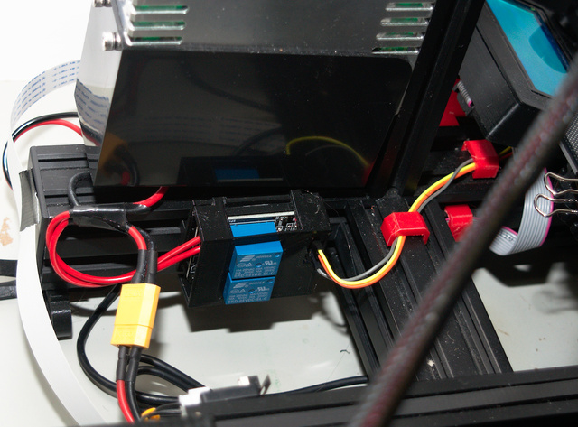

3D Printable 2 Channel Relay Slot Rail Mount 
===

Description
---
2Channel relay mount and cover which fits the channel on any 20/20 slot rai.  
Prints fast and easy. 

|  |
| :---: |
| Relay mount |

Also Published
---
[Thingiverse](https://www.thingiverse.com/thing:3954334)  
[Cults3D](https://cults3d.com/en/3d-model/tool/slot-rail-relay-mount-and-cover)

Supplies
---

Designed around these realsy but will probably fit others of similar style.  
[https://www.banggood.com/2-Channel-5V-DC-Relay-Module-Relay-Drive-Module-Control-Board-p-1557820.html?rmmds=search&cur_warehouse=CN](https://www.banggood.com/2-Channel-5V-DC-Relay-Module-Relay-Drive-Module-Control-Board-p-1557820.html?rmmds=search&cur_warehouse=CN)

Print Execution
---

### Settings
| Print Setting | Value |
| --- | --- |
| Mterial | PLA |
| Supports | No |
| Layer Height | 0.2mm |

Post Print
---

Assemble with M3 nuts and socket head cap screws.
